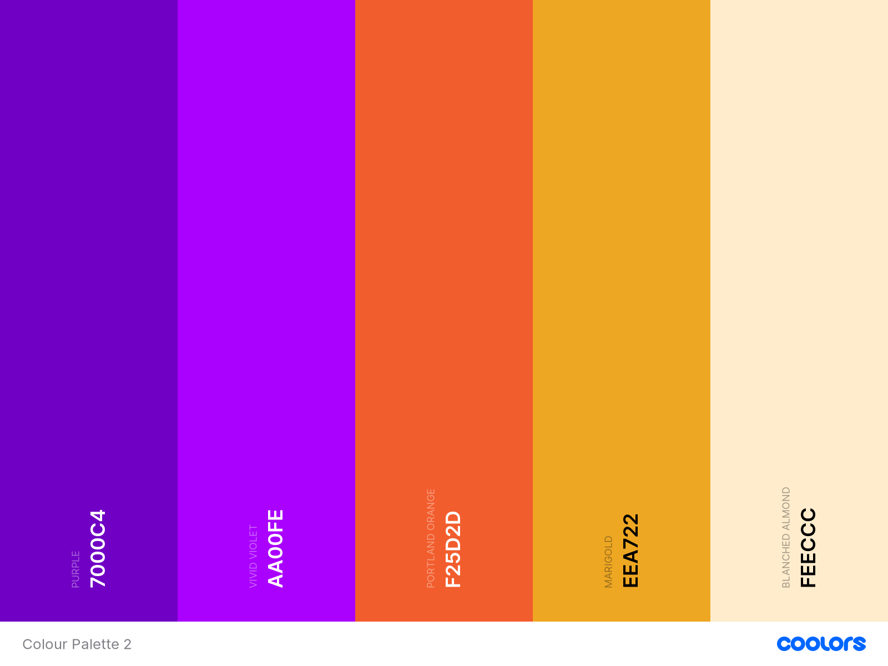

# Triviata
Triviata is a trivia game. When playing the game, the user can choose between challenge mode and practice mode. In challenge mode the user plays three rounds with increasing difficulty and with questions from every category. In practice mode, the user can choose the category and difficulty level.

# Table of Content

# UX
## **Strategic level**
This website is for people who want to play a fun or challenging game and at the same time test their knowledge.
My personal goal is to show the coding skills I learned sofar (HTML, CSS and Javascript).

### **user stories**
*first time users:*  
- As a first time user, I want to navigate easily across the website.  
- As a first time user, I want to know what the game is about, so I can play the game with ease.  

*returning users:*
- As a user, I want to play the game on different screen sizes.
- As a user, I want to have some control over the game, so I can play the game in my own pace.
- As a user, I want to see/hear if my answer is correct or not.
- As a user, I want to see the right answer, when I gave a wrong answer, so I can learn from my mistakes.
- As a user, I want to see how many points I have.
- As a user, I want to save my score and see the high scores, so I challenge myself to play better.
- As a user, I want to choose different game modes, so the game is more versatile.

### **developer stories:**
- As a developer I want to give feedback and control to the users before, during and after the game, for a better playing experience.
- As a developer I want to challenge the user, so they will come back and play some more.
- As a developer I want my users to be able to play on all devices.

## **Scope level**
Considering that I don’t have enough experience and therefore insight into how much time it costs and how difficult implementing some features are, I’ve decided to plan for a *Minimal Viable Project* first and then add the extra features, depending on how much time is left.  
**The requirements for the Minimal Viable Project:**
1. An explanation of the game.
2. Good navigation indications by use of buttons and icons.
3. A responsive design.
4. A game area with question and answers. 
5. Indication whether the given answer is correct or incorrect.
6. Indication what level the user is playing.
7. Score indication.
8. Indication on which question the user is on.
9. An option to save the score.
10. Provide high scores.

**Extra requirements:**  
1. Show the right answer.
2. Sound effects and background music and the option to turn them on/off.
3. Different player modes -> Add practice mode (the user can choose the category and difficulty level).
4. Indication of category and difficulty in practice mode.
5. An option to choose the next question.
6. Option to switch between dark and light mode.

## **Structure Level**  
The structure (and later on the wireframes) will already include the extra features. Whether or not they are implemented, will depend on the available time and the difficulty of implementation. 
During the design and development, I worked out the following ideas.

The overall look is kept the same for consistency:   
- The colours are kept the same on each page.
- The buttons are styled in a similar way.

The navigation is kept simple:   
- There are buttons to navigate the game, such as a button go to a next question, buttons to navigate to other pages like the landing/home page. 

The user is given feedback, in order to enhance a pleasant user experience:  
- This translates to visual and audio feedback during certain actions (like focusing on, clicking on or hovering over buttons or links). Examples are: the displacement of the answer box, when hovering over it. Or change of colour when clicking a button or link.
- The answer box changes colour in case of a right or wrong answer. 
- A sound is played after giving a correct or wrong answer.
- There are indications of level, category, difficulty, question number and score.

All the information should be easily visible:
- Visual aids are used, like icons and complementary colours.

The website will have 5 pages:  
A landing page, a practice selection page, a game page for practice mode, a game page for challenge mode and a high scores page.

Each page will have the same header, with options to change sound, music and light/dark mode.
Except for the landing page, all pages have a button to go back home to the landing page.

**The landing page**  
will have an option to see the explanation of the game. 
There will be a start button, which opens a link to choose a play mode. There is a link to go to the high scores page. The settings are displayed at the top of the page.

**The practice selection page**  
has the option for the user to choose the category and difficulty level of the game.

**The game page for challenge mode**  
will have a question and answer area. There will be an indicator of the score and which question the user is at. After round 1 and round 2 a modal will pop up to indicate that the user is going to another level. When all the three rounds are finished, a modal pops up. In the modal there will be an endscore, the option to save the user’s score, the option to play again and a link to the high scores page. 

**The game page for practice mode**  
will be the same as the challenge mode page, except that there is only 1 round.

**The high scores page**  
will have an overview of the top 5 players with names and scores.

## **Skeleton Level**
As mentioned above, the extra features will also be included in the wireframes. A comparison of the wireframes with the endproduct will show the implemented extra features. Also the implemented extra features will be updated in the ‘Features’ section below.

Link to [wireframes](https://github.com/chizzletaz/MSP2-TriviaQuiz/blob/master/assets/documents/Wireframes%20MSP2.pdf)

**Update:**  
By comparing the wireframes with the end result, you can see the following differences/adjustments:  
There are only 5 pages.  
The practice selection page is now a modal.  
Only the Challenge and the Practice page have the settings for music and sound.  
The option for toggling between light and dark mode has been omitted and added as a feature left to implement.
There is no modal pop up after each level.

## **Service Level**

**Colors**  
The main colours are #aa00fe (Vivid Violet) and #7000c4 (Purple). These are used as a gradient
for the background colour. 
For secondary colours I’ve used shades of orange, as this complements the purple colour well.
The shades used are #eea722 (Marigold), #f25d2d (Portland Orange) and #feeccc (Blanched
Almond).  

Furthermore green (#64bf2c) and red (#f01f0a) are used for the background colour for the right
and wrong answer respectively.

**Fonts**  
As a main font I've chosen Montserrat. This is a sans-serif typeface, which due to it's clarity and legibility, is good to use for the main text on all screen sizes. 
I've used this particular font to convey simplicity and minimalism and because I found this font to suit the game best.

For the title and game info indicators(level, score, etc) I've used the Josefin Sans font.
This is also a sans-serif typeface, which is geometric, elegant, with a vintage feeling. I liked the contrast between the typefaces. 

# **Features**

## **Existing Features**  
Feature 1 - allows users X to achieve Y, by having them fill out Z  
**All pages:**  
Responsiveness - allows users to play the game on different devices.

**Landing page:**  
- A button that opens a modal, where users can choose a game mode and start playing.  
- A button that allows users to navigate to the high scores page.  
- A button that opens a modal where the users can read how to play the game.

**Challenge page:**
- A HUD (Heads Up Display) where users can see which level they are playing on, which question they are on and what their score is.
- Icons for background music and sound settings. Clicking the icon turns the music/sound on or off. The icons collapse to a settings-icon on smaller screen sizes.
- A question-area where users are presented with a question.
- Answer-containers where users can select an answer.
- A button that allows users to return to the landing page.
- A button that allows users to go to the next question.
- An end of game modal where users can enter their name and save their score. Users can only save their score if they have entered a name. If the score is high enough, it is included in the high scores, which can be seen on the high scores page.

**Practice page:**  
The practice page has the same features as the challenge page plus these extra features:
- A modal that shows on loading, where users can choose the category and difficulty of the questions.
- An extra indication in the HUD, where users can see what category and difficulty level they are playing.  

N.B! The practice page doesn’t have an end of game modal.

**High scores page:**  
- A table where users can see the ranking of the top 5 best scores with the corresponding names.
- A button that allows users to return to the landing page.

## **Features Left to Implement**
- A timer: the questions have to be answered within a certain time limit, e.g 10 seconds.
- The score is linked to how fast a user answers the question.

## **Technologies used**

**languages used**  
- [HTML5](https://en.wikipedia.org/wiki/HTML) for markup  
- [CSS](https://en.wikipedia.org/wiki/CSS) for styling
- [Javascript](https://en.wikipedia.org/wiki/JavaScript) for  interactivity

**Frameworks, libraries and programmes used**   
- [Bootstrap 4.5.3](https://getbootstrap.com/) was used for precoded code-snippets, like navigation bar, modals, carousel and to help with the responsiveness of the website.  
- [Balsamiq](https://balsamiq.com/) for making the wireframes.  	
- [Git](https://git-scm.com/) was used version control.  
- [GitHub](https://github.com/) for storing and deploying the website.  
- [GitPod](https://www.gitpod.io/) for coding (IDE) the website.  
- [Atom](https://atom.io/) for trying out code (IDE), due to limited usage time on gitpod.
- [Google fonts](https://fonts.google.com/) for the fonts used in the website.  
- [Font Awesome](https://fontawesome.com/) for the icons used on the website.  
- [Hover.css](https://ianlunn.github.io/Hover/) was used for the hover effect on the navigation-links.  
- [Chrome Developer Tools](https://developers.google.com/web/tools/chrome-devtools)
was used to debug and checking/testing the website.

# **Testing**
In this section, you need to convince the assessor that you have conducted enough testing to legitimately believe that the site works well. Essentially, in this part you will want to go over all of your user stories from the UX section and ensure that they all work as intended, with the project providing an easy and straightforward way for the users to achieve their goals.
Whenever it is feasible, prefer to automate your tests, and if you've done so, provide a brief explanation of your approach, link to the test file(s) and explain how to run them.
For any scenarios that have not been automated, test the user stories manually and provide as much detail as is relevant. A particularly useful form for describing your testing process is via scenarios, such as:
Contact form:
Go to the "Contact Us" page
Try to submit the empty form and verify that an error message about the required fields appears
Try to submit the form with an invalid email address and verify that a relevant error message appears
Try to submit the form with all inputs valid and verify that a success message appears.
In addition, you should mention in this section how your project looks and works on different browsers and screen sizes.
You should also mention in this section any interesting bugs or problems you discovered during your testing, even if you haven't addressed them yet.
If this section grows too long, you may want to split it off into a separate file and link to it from here.
4. Testing
	The testing writeup should go through your  site with a fine tooth comb and document
clearly everything you have done  to ensure that your site works.
Testing is far more than just confirming  that the navigation links work.
You also need to consider your sites  responsiveness and browser compatibility.
You should go back over the user stories you defined  in the UX section and go through each one,
document in detail how your site meets  these pre-identified needs and wants.

Use the HTML an CSS online validators.
Use Chrome Dev Tools: right click -> inspect -> search/select Lighthouse from the top screen.

## **Deployment**

To deploy this website to GitHub, I followed the these steps:

1. Go to GitHub.com and on the left side click on the repository:chizzletaz/MilestoneProject1.
2. In the repository click on the ‘Settings’-tab at the top.
3. Scroll down to ‘GitHub Pages’.
4. Under ‘Source’ you see the word ‘None’ with a dropdown menu: select ‘master branch’.
5. Click ‘Save’, this will give you a URL of the website (see above ‘Source’).

Local Clone:
1. Go to GitHub.com and on the left side click on the repository.
2. Click on the ‘Code’ button.
3. To clone using HTTPS, copy the link that is displayed.
4. Open a terminal in your preferred IDE (e.g. Atom)
5. Use  the ‘git clone’ command and add the link that you copied in step 3.  For Atom: Toggle command palette (cmd-shift-p (macOS) or shift-p (Linux/Windows) and search ‘git clone’: Add the link and 
6. A clone will be created locally.

For more info on how to clone a repository check [here](https://docs.github.com/en/free-pro-team@latest/github/creating-cloning-and-archiving-repositories/cloning-a-repository)

# **Credits**
### code

- A large part of the html, css and javascript was based on the [youtube tutorial](https://www.youtube.com/watch?v=u98ROZjBWy8&list=PLDlWc9AfQBfZIkdVaOQXi1tizJeNJipEx) of James Q Quick. See also his [GitHub page](https://github.com/jamesqquick/Build-A-Quiz-App-With-HTML-CSS-and-JavaScript) for the code.
- How to build a [Loader](https://www.w3schools.com/howto/howto_css_loader.asp).  
- How to play audio for correct/incorrect answer:
[Uri](https://stackoverflow.com/questions/9419263/how-to-play-audio).
- [Removing the eventListener](https://developer.mozilla.org/en-US/docs/Web/API/EventTarget/addEventListener) after it is invoked.
- How to add an event after a modal closes: [user4639281](https://stackoverflow.com/questions/39323598/execute-code-after-modal-closes-if-okay-button-clicked)
- How to get the text value of a [selected option](https://learn.jquery.com/using-jquery-core/faq/how-do-i-get-the-text-value-of-a-selected-option/)
- How to [prevent pull-to-refresh](https://developers.google.com/web/updates/2017/11/overscroll-behavior) on (most) mobile devices.

### Content
The text for section Y was copied from the Wikipedia article Z

### Media
Images  
- [Background image](https://wallpaper-house.com/wallpaper-id-488333.php) of index.html page.  
- [Trophy image](https://iconarchive.com/show/noto-emoji-activities-icons-by-google/52725-trophy-icon.html)  
- Icon music on: Icon by <a href="https://freeicons.io/profile/6156">Reda</a> on <a href="https://freeicons.io">freeicons.io</a>  
- Icon music off: Icon by <a href="https://freeicons.io/profile/6156">Reda</a> on <a href="https://freeicons.io">freeicons.io</a>
Icon [settings](https://www.iconfinder.com/icons/4200781/cogwheel_configuration_gear_settings_icon)                        

Music  
- [background music](https://www.chosic.com/download-audio/?t=27247)
Monkeys Spinning Monkeys Kevin MacLeod (incompetech.com)  
Licensed under Creative Commons: By Attribution 3.0 License http://creativecommons.org/licenses/by/3.0/  
Music promoted by https://www.chosic.com/  

sounds:  
- Correct answer: [Correct answer 9](https://www.dreamstime.com/stock-music-sound-effect/correct-answer.html)  
- Wrong answer: [Gameshow wrong answer fail buzzer bleep](https://www.dreamstime.com/stock-music-sound-effect/wrong-answer.html)

# Acknowledgements
I received inspiration for this project from X

