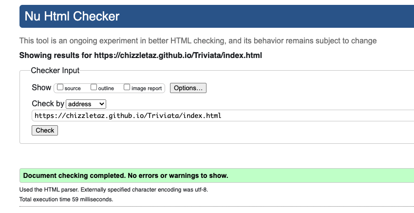
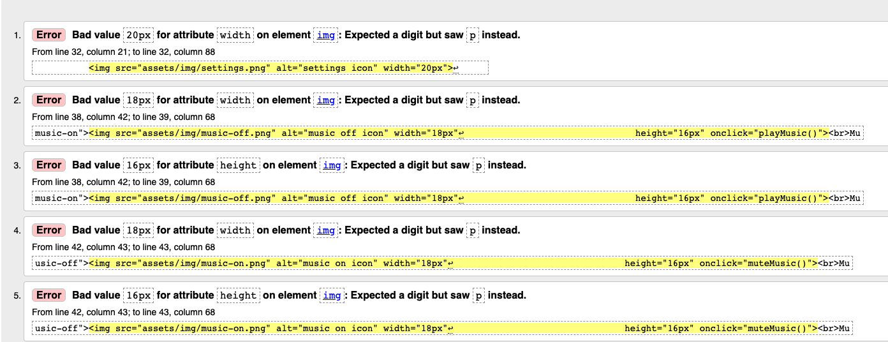
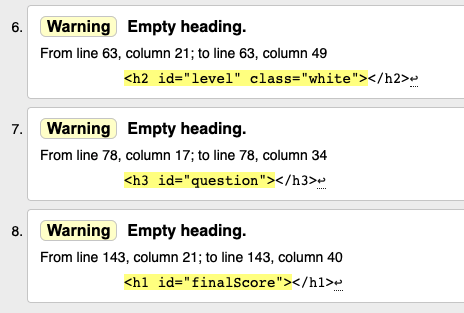
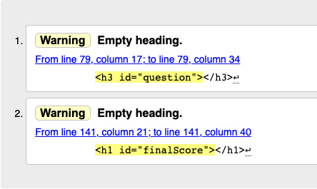
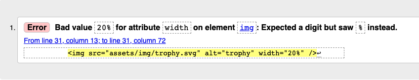

Go to [README file](README.md)

# **Testing**
## Table of Contents
- [Testing User stories](#testing-user-stories)  
    * [First time users](#first-time-users)
    * [Returning users](#returning-users)
    * [Developer stories](#developer-stories)
- [Manual testing features](#manual-testing-features)
- [Code Validation](#code-validation)  
- [Testing across web browsers](#testing-across-web-browsers)  
- [Testing Responsiveness](#testing-responsiveness)  
- [Bugs and Problems](#bugs-and-problems)  
***

## Testing user stories
### First time users:
**1. As a first time user, I want to navigate easily across the website.**  
- The user can return to the landing page by either using the 'Triviata' text on top of the challenge, practice and high scores page or use the button with the home-icon. 
- The user can use buttons to navigate to the game pages or the high scores page.

**2. As a first time user, I want to know what the game is about, so I can play the game with ease.**
- On the landing page there is a button named ‘How to play’. When the user clicks this button a modal opens with the explanation of the game.

### Returning users:  
**1. As a user, I want to play the game on different screen sizes.**  
- The user can use a mobile device, a tablet or a desktop computer to play the game. See [below](## Testing browser compatibility) for testing.

**2. As a user, I want to have some control over the game, so I can play the game in my own pace.**  
- During the game the user can use the ‘next question’ button to go to the next question.
- The user can return to the landing page whenever he/she wants.
When playing in challenge mode, after each round a modal pops up where the user can choose to go to the next level. 

**3. As a user, I want to know if my answer is correct or not.**  
- When the user gives an answer, the background colour of the answer turns green or red for a right or wrong answer respectively.
- When the user gives a right answer, a right-answer sound is played. 

-  When the user gives a wrong answer, a wrong-answer sounds is played.

**4. As a user, I want to see the right answer, when I gave a wrong answer, so I can learn from my mistakes.**
- When the user gives a wrong answer, the right answer is shown with a green background.

**5. As a user, I want to see how many points I have.**  
- On the challenge and practice pages the user can see his/her score at the top of the page.

**6. As a user, I want to save my score and see the high scores, so I challenge myself to play better.**  
- After playing the challenge game, the user can save his/her score. 
- If the score is high enough, it is added to the high scores page.
- The user can go to the high scores page directly after playing the game or by clicking the ‘High Scores’ button on the landing page.

**7. As a user, I want to choose different game modes, so the game is more versatile.**  
- The landing page has a ‘Start playing’ button. When clicked, a modal opens and allows the user to choose between ‘Challenge’ mode or ‘Practice’ mode.

### **Developer stories:**  
**1. As a developer I want to give feedback and control to the users, for a better and pleasant playing experience.**  
- The challenge page has a Heads Up Display (HUD) at the top of the page where the level, the question the users are on and the score is displayed.
- The practice page also has the category and the difficulty level displayed in the HUD.
- On the challenge and practice page users have the option to use background music and sound effects. The users can turn the background music and the sound effects on or off.
- On the practice page the users can choose the category and difficulty level they want to play.
- When the users finish the first level on the challenge page, a modal pops up. The users get a stimulation message and the notification they are going to the next level. The users continue to the next level by clicking the ‘Next Level’ button.

**2. As a developer I want to challenge the users, so they will play another game or they will come back another time.**  
- The challenge page has three levels. The questions increase with difficulty every time a new level is played.
- The users can save their score and check out if their score made it to the high scores.

**3. As a developer I want my users to be able to play on all devices.**  
- The game is made responsive, so the users can play on a mobile device, a tablet or a desktop.

## Manual testing features
**Navigation to the landing page:**  
Expected: The logo text and the home button direct the user to the landing page.
Testing:
1. Go to any page but the landing page.  
2. Click on ‘Triviata’-text at the top of the page and verify you are directed to the landing page.
3. Go to any page but the landing page.
4. Click on the button with the house-icon and verify you are directed to the landing page.

Result: The logo text and the home button directs the user to the landing page.

**Start playing modal:** 
Expected: A playing mode can be chosen and the chosen game starts when the user chooses a playing mode.  
Testing:
1. On the landing page, click on the ‘Start Playing’ button.
2. Click on the ‘Challenge’ button. 
3. Verify that you are directed to the challenge game page and the game starts.
4. Go back to the landing page and click on the 'Practice' button.
5. Verify that you are directed to the practice game page and the game starts.

Result: A playing mode can be chosen and the chosen game starts when the user chooses a playing mode.

**Explanation of the game:**  
Expected: Instructions are displayed when the ‘How to play’ button is clicked.  
Testing:
1. Go to the landing page.
2. Click on the button that says ‘How to play’.  

Result: A modal pops up with the explanation of the game.

**Indication of the right or wrong answer:**  
Expected: When giving a right answer, the given answer-container turns green and a correct-anwer-sound is played, when the sound is turned on. When giving a wrong answer, the answer-container turns red and an incorrect-answer-sound is played, when the sound is turned on.  
Testing:
1. Go to the Challenge page.
2. Verify that, in the top right corner, the ‘sound off’ icon is shown. 
3. Choose an answer and click on it.
4. Verify that the selected answer turns green when it ’s right or turns red when it’s wrong.
5. Repeat step 4 till you have selected a right and a wrong answer at least once.
6. Turn the sound effects on by clicking the sound-off-icon.
7. Repeat steps 3 to 5 and verify that a sound is played when selecting an answer.

Result: When giving a right answer, the given answer-container turns green and a correct-anwer-sound is played, when the sound is turned on. When giving a wrong answer, the answer-container turns red and an incorrect-answer-sound is played, when the sound is turned on.

**Showing the right answer:**  
Expected: When a wrong answer is given, the right answer is shown in green.  
Testing:
1. Go to the challenge page.
2. Select a wrong answer (or try again until you give a wrong answer).
3. Verify that the right answer is shown in green.
4. Go to the Practice page.
5. Repeat steps 2 and 3.

Result: When a wrong answer is given, the right answer is shown in green.

**Next Question button:**  
Expected: When clicking the ‘Next Question’ button, a new question with answers is presented.  
Testing:
1. Go to the challenge page.
2. elect an answer.
3. Click the ‘Next Question’ button and verify that a new question and new answers are given.
4. Go to the practice page.
5. Repeat steps 2 and 3.

Result: When clicking the ‘Next Question’ button, a new question with answers is presented.

**Level indication:**
Expected: During the challenge game the level the user is on is displayed and increases with each level.
Testing:
1. Go to the challenge page.
2. Verify that in the top left corner the level is displayed as 'Level: 1'
3. Play 10 questions and click the ‘Next Level’ button.
4. Verify that the level indicator increases to 2. 
5. Repeat step 3 and verify the level indicator increases to 3.
Result: During the challenge game the level the user is on is displayed and increases with each level.

**Question progress indication:**
Expected: During the game the question the user is on is indicated with text and a progress bar and is update after each question.
1. Go to the challenge page.
2. Verify that the question progress indicator says: Question 1 of 10 and the progress bar is filled by 10%.
3. Play a question.
4. Verify that the question progress indicator increases by 1 and the progress bar is filled 10% extra.
5. Repeat steps 2 and 3 for the remaining questions.
6. Go to the practice page and repeat steps 2 to 5.
Result: During the game the question the user is on is indicated with text and a progress bar and is update after each question.

**Score indication:**
Expected: During the game the score is indicated and when a right answer is given, the score increases by 10, 20 or 30 depending on which level is played.
1. Go the challenge page.
2. Verify that the score indicator says 0.
3. Play a question.
4. Verify that when given a wrong answer the score remains the same and when given a right answer the score increases with 10.
5. epeat steps 3 and 4 for level 2 and verify that the score increases with 20.
6. Repeat steps 3 and 4 for level 3 and verify that the score increases with 30.
7. Go to the practice page.
8. Repeat steps 2, 3 and 4.
Result: During the game the score is indicated and when a right answer is given, the score increases by 10, 20 or 30 depending on which level is played.

**High scores page:**  
Expected: Navigation to the high scores page works. The high score page shows the 5 best scores with name and rank.  
Testing:
1. Click on the ‘High Scores’ button on the landing page and verify you are directed to the high scores page.
2. Remember if there are names and scores displayed and if so, remember the lowest score.
3. Go to the challenge page.
4. Play a full game (three levels).
5. Verify that a modal pops up, where you can enter you name and save your score.
6. Enter your name and click ‘Save’.
7. Compare your score with the lowest score in step 2.
8. If your score is higher than the lowest score, verify that your score is displayed in the High Scores. 
9. If there were no scores in the High Scores list. verify that your score is displayed in rank number 1.
10. Repeat steps 3 to 8 five more times and verify the High Scores page shows the 5 highest scores.
11. Repeat step 3 to 5.
12. Click on the ‘High Scores’ button and verify you are directed to the high scores page.

Result: Navigation to the high scores page works. The high score page shows the 5 best scores with name and rank.

**Music and sounds settings:** 
Expected: The background music and sound effects can be turned on and off. The selected choice is stored.  
Testing:
1. Go to the challenge page.
2. Verify the default settings are that music and sound are turned off.
3. Click the music icon to turn on the music and verify the music is playing.
4. Return to the landing page and verify the music stops playing.
5. Go to the challenge page and verify that the music starts playing.
6. Return to the landing page.
7. Go to the practice page and verify that the music starts playing.
8. Click the music icon to turn off the music.
9. Go to the practice page and verify that the music stays mute.
10. Go to the challenge page and verify that the music stays mute.
11. Click on the sound icon to turn on the sound effects.
12. Select an answer and verify a sound plays.
13. Return to the landing page.
14. Go to the challenge page. 
15. Select an answer and verify a sound plays.
16. Go to the practice page.
17. Select an answer and verify a sound plays.
18. Click on the sound icon to turn off the sound effects.
19. Go to the practice page, select an answer and verify no sound plays.
20. Go to the challenge page, select an answer and verify no sound plays.

Result: The background music and sound effects can be turned on and off. The selected choice is stored.

**Save score:**  
Expected: After playing a game in challenge mode, the score can be saved when a name is entered.  
Testing:
1. Go to the challenge page.
2. Play a full game.
3. Verify a modal pops up where you can enter your name and save your score.
4. Without entering a name, click save.
5. Verify the save button can’t be clicked.
6. Enter a name and click the save button.
7. Click the ‘High Scores’ button and verify your score is added to the high scores.

Result: After playing a game in challenge mode, the score can be saved when a name is entered.

**Practice page modal:**  
Expected: When playing practice mode, a category and difficulty level can be chosen. The chosen category and difficulty level are displayed in the HUD at the top of the page.  
Testing:
1. Click on the ‘Start Playing’ button.
2. Click on ‘Practice’.
3. Verify a modal pops up where you can choose a category and a difficulty level.
4. Select a category and click the ‘Start’ button.
5. Verify the HUB displays the category you chose.
6. Return to the lading page.
7. Go to the practice page.
8. Select a difficulty level and click the ‘Start’ button.
9. Verify the HUB displays the difficulty level you chose.

Result: When playing practice mode, a category and difficulty level can be chosen. The chosen category and difficulty level are displayed in the HUD at the top of the page.

## Code validation
[W3C Markup Validation Service](https://validator.w3.org/) is used to check for markup validity of the web document.
Running the code through the validator gives:  
### For index.html:
- No errors or warnings to show.

### For challenge.html:
- 5 errors for bad value for the attribute 'width' and 'height'.

This can be resolved by removing the px from the width and height attribute of img tag. After removing the px, the errors are gone.

- 3 errors for an empty heading.
  
The heading is empty because the content is added by Javascript. For this reason the errors are kept in.

### For practice.html:
- An error for an empty heading.
  
The heading is empty because the content is added by Javascript. For this reason the errors are kept in. 

### For highscores.html:
- An error for a bad value for the attribute 'width' and 'height'.

This can be resolved by changing 'width="20%"' to 'style="width:20%"'.
After the change no errors or warnings are shown.
---
[W3C CSS Validation Service](https://jigsaw.w3.org/css-validator/) is used to check the CSS of the web document.
Running the code throught the validator by direct input gives

## Testing browser compatibility
I've tested the site on Safari, Chrome and Mozilla Firefox.

## Testing responsiveness
To test the responsiveness of the  website, I've used [Chrome Dev Tools](https://github.com/chizzletaz/MilestoneProject1/blob/master/assets/img/extra/responsiveness_chrome_dev_tools.png) and [Responsinator](https://www.responsinator.com/). 

## Bugs and problems

SOLVED
Making a function: when clicking 'next question'-button, the green and red backgrounds of the answers 
are removed and a new question is loaded.

function goToNextQuestion() {
    nextQuestion.addEventListener('click', () => {
        let answers = document.getElementsByClassName('answer-container')
        answers.forEach(answer => {
            answer.classList.remove('correct');
            answer.classList.remove('incorrect');
        });
        getNewQuestion();
    }); 
}
Doesn't work.

function goToNextQuestion() {
    nextQuestion.addEventListener('click', () => {
        const numb = currentQuestion.answer;
        const choices = document.querySelectorAll('[data-number]');
        choices[numb -1].parentElement.classList.remove('correct');
        getNewQuestion();
    }); 
}

function is working partially. The red background (incorrect answer) isn't removed.

putting the eventListener inside the eventListener to which answer is given:
nextQuestion.addEventListener('click', () => {
            const numb = currentQuestion.answer;
            const choices = document.querySelectorAll('[data-number]');
            choices[numb -1].parentElement.classList.remove('correct');

            selectedChoice.parentElement.classList.remove(classToApply);
            
            getNewQuestion();
});

This works, but the end-modal is shown 1 question too soon (after 2 instead of 3 questions).
When using console.log(availableQuestions.length), after question 1 the number is 9, after question 2, 
the number is 8 and goes directly to 7. 
After consulting with Tutor assistance, the issue seemed that after each question I was adding another
eventListener. 
The solution was to remove the eventListener after use. 
According to [Developer.Mozilla](https://developer.mozilla.org/en-US/docs/Web/API/EventTarget/addEventListener)
you can add {once: true}, this indicates that the listener should be invoked at most once after being added. 
If true, the listener would be automatically removed when invoked.

---
SOLVED
The user can turn on/off the sound and/or background music. The functions for this work, however,
when a user changes the default setting and refreshes the page, the user's changes don't stay and the default settings return.
Fix: with help of my tutor Antonio Rodriguez, we fixed the problem. 
By adding functions that check whether the music and sound is on or off and adding these functions to the fetchQuestion function.
The default setting is that music and sound are off. If the user changes the setings, the setting is set to localStorage.
Upon loading the challenge or practice page, the checkMusic and checkSound function check the settings and change the default
setting if neccesary.

---
SOLVED
I made three levels of the game. After the number of questions for level 1, the game automatically goes to level 2 (and from level 2
to level 3). 
However at the end the questionindicator adds another question and the progressBar goes [outside](/workspace/MSP2-TriviaQuiz/assets/documents/questionindicator-flaw.png) it's container.
Fix: I've put the condition to go the next level (if (availableQuestions.length === 0 || questionCounter >= max_Questions) {....) before the function getNewQuestion 
(inside the nextQuestion-eventListener), in stead of in the function getNewQuestion itself. This seems to have solved the problem.

---
SOLVED
I want to add a Session Token to the URL, so the user doesn't get the same question twice.
To do this I made a function that gets a Session Token from the API and adds it to the URL.
In order to get the Session Token before fetching the questions, the window.onload should load the getToken function first.
So the fetchQuestions function is put inside the getToken function.

This works, but now every time a new level is reached, a new session token is retrieved. This could still give the same questions,
because the condition that the same question is not used is valid per token.

Idea: Get the token on loading the index.html page and set to localStorage.
This works. However, everytime the user goes to the home page, a new Session Token is retrieved.

According to the API documentation, a session token is deleted (i.e. unusable) after 6 hours.
IDEA:Check the time stamp of the token: if it is older than 6 hours; get a new token. 
Else use the token in localStorage. 
Using and modifying the localStorage example with timestamp [Credit:dotspencer](https://gist.github.com/dotspencer/a99e004a31cbd93fa8f7828bece58708),
I added the a timestamp to the token and saved it as an object to localStorage.
In the game.js the token is retrieved to be used in the game.
Issue: the first time there is no key in localStorage, this gives an error. So I made a function for checking the token and invoking this function on
window.onload.
